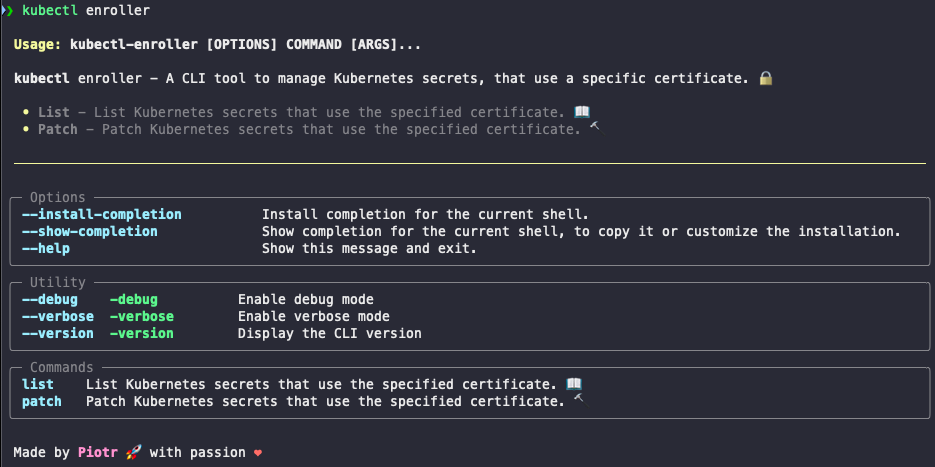

# kubectl-enroller

A kubectl plugin that allows you to manage certificates in Kubernetes.

## Requirements

- Python 3.12.6 or later
- pipx

## Installation

`pipx install git+https://github.com/User-Piotr/kubectl-enroller`

This will install the plugin and make it available as `kubectl enroller`.

## Usage

`kubectl enroller` - compares a local certificate with all secrets across multiple namespaces in the cluster. If a matching certificate is found, it updates the secret with the new certificate.

---

